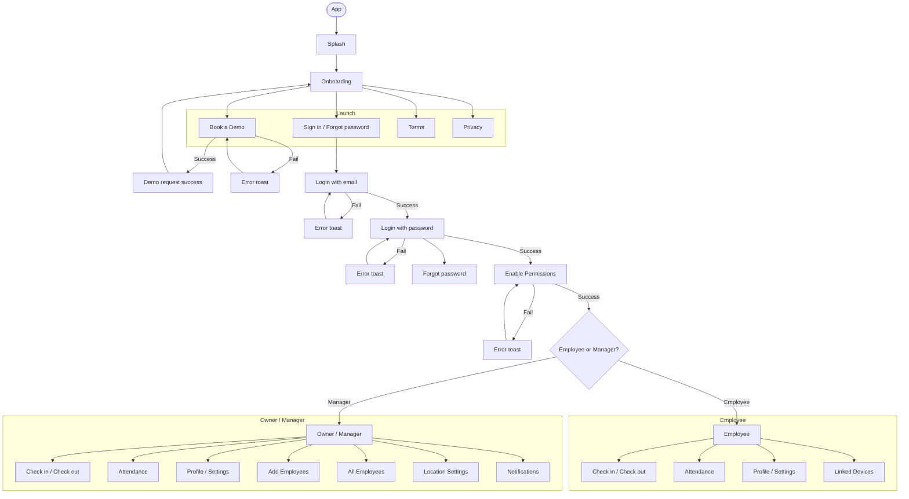
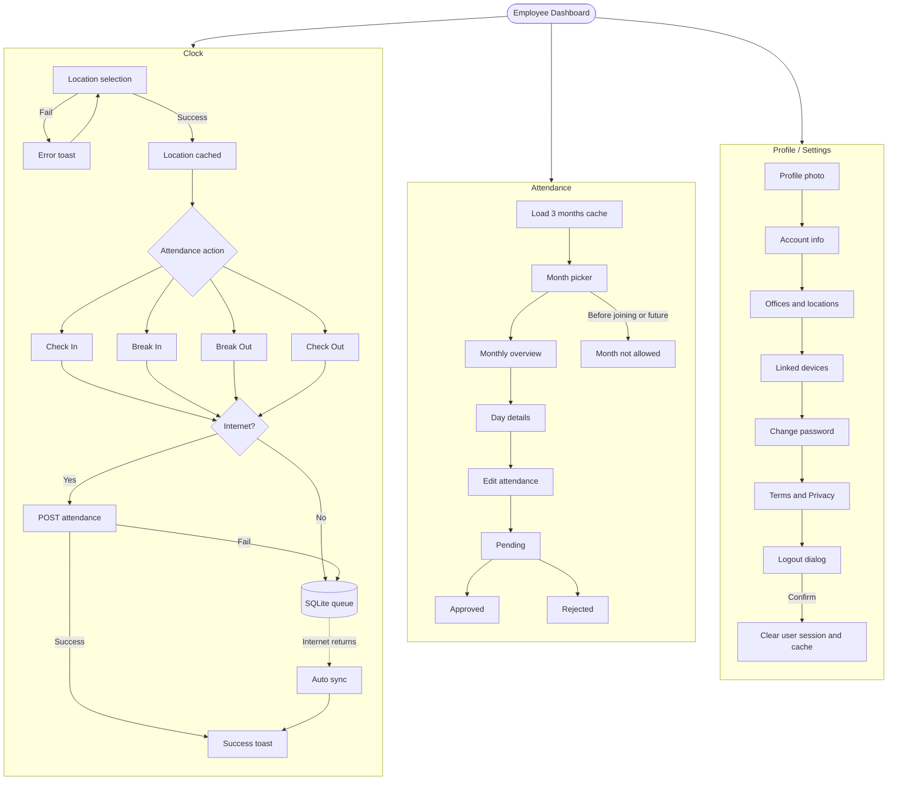

# Obecno Employee App — Simple Specification

**Who this is for:** Flutter developers, designers, backend, QA, and product.

**What this document is:** A full guide to the **employee side** of the Obecno app. It says what the product needs, what the app already does, where those two disagree, and what is still missing.

This document is about **employees only**. Manager screens in the same project are out of scope, except where they share the same widgets.

---

## How to read this document

We used three sources, in this order:

1. **Product PDF** (`employee.pdf`) — this is the main product requirement. Do not change it.
2. **Current Flutter app** — what the code actually does today.
3. **Extra rules for this document** — do not skip screens, do not change the current app architecture, and do not invent API fields that nobody gave us.

| Label | Meaning |
| --- | --- |
| **PDF requirement** | Written in `employee.pdf`. Must not be changed. |
| **Current app** | What the Flutter code does today. |
| **Extra rule** | Extra constraint from the request that created this document. |
| **Unknown** | Not in the PDF and not proven in the code. |
| **Suggested fix** | A safe way to close a gap. This is not a new product requirement. |
| **Conflict** | The PDF and the code disagree. Keep both. Do not silently pick one. |

**Status words used later**

| Status | Meaning |
| --- | --- |
| **Done** | Matches the need. |
| **Partly done** | Exists, but is incomplete. |
| **Missing** | Not built yet. |
| **Wrong** | Built, but it does the wrong thing. |
| **Needs check** | We cannot confirm without backend or product. |

**Do not invent APIs.** If the PDF says one field name and the live app sends another, this document lists both. Keep the live API unless product and backend both ask to change it.

---

## Do not replace the current architecture

Keep these as they are:

- **State:** custom `ChangeNotifier` + `ChangeNotifierProvider` / `MultiProvider`. Do not switch to GetX, Riverpod, or Bloc.
- **Routing:** `go_router` in `lib/features/employee_module/routes/app_routes.dart`.
- **Network:** `ApiClient` → repositories → services → providers.
- **Clock code:** `lib/features/clock` (moved out of `employee_module/clock`).
- **Offline punch queue:** SQLite database `obecno_attendance_queue.db` through `LocalQueueService`.
- **Attendance history cache:** SQLite `AttendanceDb` + `AttendanceDao`.
- **Login session:** `TokenService` (secure storage) + `AuthProvider.sessionEpoch` (a number that goes up on logout so old work stops).

**FigJam board (same boxed-flow style as `Flow 1st Version.pdf`):** [Obecno App Flow](https://www.figma.com/board/Ef82Yr9wZLGxqdh2k5VDPH)

---

## 0. Flow diagrams

Style matches **Flow 1st Version.pdf**: App → Splash → Onboarding → Demo / Sign in → Manager vs Employee, then each role’s modules. Employee modules are expanded from `employee.pdf` (success / fail / offline).

### 0.1 App map — like Flow 1st Version



### 0.2 Employee modules — Clock, Attendance, More



---

## 1. What the employee app does

### PDF requirement

The employee app is an attendance app that still works without internet.

A user:

1. Installs the app.
2. Sees splash for **2 to 4 seconds**.
3. Completes onboarding.
4. Either books a demo, or logs in with email, then password or OTP.
5. Grants **Location**, **Notifications**, and **Motion / Physical** phone permissions. The user cannot continue until all three are given.
6. Lands on the employee home screen (Clock).

From Clock the employee can:

- Pick an office / location (the app stores the latest list).
- Mark **Check In / Break In / Break Out / Check Out**.
- On every action: send status + date + time + current latitude/longitude; check phone permissions again; fetch the latest company rules; if there is no internet, save the action in SQLite and send it later with no extra taps; use already stored rules, locations, grace time, and break length.
- See a Clock card where the **first check-in of the day stays the same** (with location), while **check-out can change** (with location). Tapping “view details” opens a bottom sheet of all actions. The same day can have many check-in / break / check-out cycles.

Attendance history:

- Load **3 months** into cache automatically.
- Month picker in the header: current month and months since joining. **Never before the joining month. Never future months.**
- Monthly overview card.
- Tapping a day opens attendance details (repeatable check-in / break / check-out cycles).
- Edit Attendance bottom sheet sends a request. The UI shows pending until it is approved or rejected, then details update.

More (profile / settings):

- Profile picture: dummy until approved; approved image after approval; offline uses cache.
- Account info (fields come from the backend) and permissions; offline uses cache.
- Office / locations from cache if offline.
- Change password.
- Terms and Privacy: fetch latest, fall back to cache.
- Linked devices: approved, blocked, pending, requested; fetch latest, fall back to cache.
- Logout dialog. On confirm, clear **that user’s** session and cache.

Toasts and dialogs exist for success (for example “Checked In Successfully”) and early checkout confirmation (“Check out early? Your checkout time is [6:00 PM]” / Cancel / Yes, Check Out).

### Current app

Obecno is one Flutter app for two roles. After login, `AuthProvider.homeTarget` sends:

- **employee** → `/employee_nav`
- **manager / owner / admin** → `/manager_nav`

Employee home is a 4-tab `IndexedStack` (tabs keep their state):

1. Clock (`ClockScreen`)
2. Attendance (`EmployeeAttendanceScreen`)
3. Alerts (`AlertsScreen` — currently “Coming soon”)
4. More (`ProfileSettingsScreen`)

Clock punches and attendance history already work offline in a large way. Device registration, company-rule cache, user-scoped SQLite, and session-epoch guards already exist.

These PDF items are only partly done: OTP login, email/password fail toasts, early-checkout dialog, dummy profile photo until approval, motion check on punch, and the network call `POST /auth/logout`.

### Extra rule

Do not invent API fields. The PDF says `status, date, time, lat, long`. The live app sends `action, datetime, lat, lon, device_details`. Document both. Do not change the live contract unless product asks.

---

## 2. Full user journey

```
Install
  → Splash (PDF: 2–4s; current app: about 2s remaining wait)
    → if onboarding not done: Onboarding
    → if onboarding done and no login: Login Email
    → if logged in and all phone permissions given: Employee Clock (or Manager home)
    → if logged in but phone permissions missing: Enable Permissions

Onboarding
  → Book a Demo
      → check the form → POST /employee/tickets
        → success: Demo Request Success → back to Onboarding
        → fail: stay, error toast
  → Already have an account → Login Email
  → Terms / Privacy (content comes from the backend)

Login Email
  → POST /auth/login { email }
    → success (exists=true): Login Password (email is carried forward)
    → fail: stay; PDF wants toast + field error; current app: field error only

Login Password / OTP
  → PDF: password OR OTP
  → Current app: password only (at least 6 characters); Forgot Password is a separate screen
  → POST /auth/login { email, password, remember_me }
    → fail: stay; PDF wants toast + field error; current app: field error only
    → success:
        save token, user, company, locations, permissions
        register this phone in the background (POST /employee/devices)
        if phone permissions are already given → Clock home
        else → Enable Permissions (AppGuard dialogs are turned off so they do not clash)

Enable Permissions
  → Location When-In-Use + Notification + Activity Recognition (motion)
  → cannot tap Continue until all are given
  → success toast → role-based home → then device status toast/dialog

Device Approval (does not block login)
  → Approved: no alert
  → Unregistered / Pending / Requested: toast “you logged in from unregistered device”
  → Blocked / Rejected: toast + dialog + /device_blocked

Dashboard / Clock
  → pick location (cached + refresh)
  → Check In / Break / Check Out
  → card + details sheet
  → Attendance tab (3-month cache, month picker, details, edit request)
  → More (profile, account, locations, devices, password, terms, privacy, logout)
  → Logout dialog → clear this user’s session + caches → Onboarding
```

### Returning user (already logged in before)

`Splash` → `AuthProvider.checkSession()` → restore company/locations from secure storage → `GET /auth/me` (remembered for 5 minutes) → refresh company rules `GET /employee/permissions` → if phone permissions are given, go home; else Enable Permissions → in the background, register the device and check its status.

---

## 3. Every screen

For each screen this section covers: name, purpose, how you enter, how you leave, UI, actions, API, checks, success, failure, offline, loading, and cache.

### 3.1 Splash

| Field | Detail |
| --- | --- |
| Screen name | Splash |
| Purpose | Show the brand and start the app (onboarding flag, login session, phone permissions). |
| Entry | App launch `/` |
| Exit | `/onboarding`, `/login`, `/employee_nav` or `/manager_nav`, `/enable_permissions` |
| UI | Obecno logo, fade/scale animation |
| User actions | None |
| API | Indirect: `GET /auth/me` through `checkSession` if onboarding is done |
| Checks | None |
| Success | Route to the right next screen |
| Failure | Not logged in → login |
| Offline | Local session still goes home. `/auth/me` may fail without logout unless the server returns 401/403/419 |
| Loading | Animation only (no spinner) |
| Cache | Reads `onboarding_completed`, session flags, token |

**PDF requirement:** 2 to 4 seconds.  
**Current app:** Waits remaining time so splash is at least **2 seconds** (`Duration(seconds: 2)`), even though a comment says “at least 4 seconds”.  
**Conflict:** Duration.  
**Status:** **Wrong** compared with the 2–4s PDF window and the 4s comment. Align the wait to 2–4 seconds. Do not change routing.

### 3.2 Onboarding

| Field | Detail |
| --- | --- |
| Screen name | Onboarding |
| Purpose | Introduce the product; Book Demo vs Already have account; legal links |
| Entry | Splash if onboarding is not done; back from Login; after logout |
| Exit | `/bookdemo`, `/login`, TermsScreen, PolicyScreen |
| UI | 5 auto-scrolling pages, progress bars, two buttons, Terms text |
| User actions | Swipe, Book a demo, Already have an account, open Terms/Privacy |
| API | None on this screen. Terms/Privacy fetch when those screens open or preload |
| Checks | None |
| Success | Navigation |
| Failure | Not applicable |
| Offline | Pages are local images. Terms/Privacy use cache if they were fetched before |
| Loading | Page animation |
| Cache | `TokenService.markOnboardingCompleted()` when the user continues (confirm the exact call on Book Demo / Login) |

**PDF requirement:** Onboarding → already have an account, Book a demo; Terms from backend; Privacy from backend.  
**Current app:** Matches. Pages: Attendance Simplified, Check In & Out, Office & Locations, See Attendance Clearly, Secure Device Access.

### 3.3 Book a Demo

| Field | Detail |
| --- | --- |
| Screen name | Book a Demo |
| Purpose | Capture a lead and submit a ticket |
| Entry | Onboarding “Book a demo” `/bookdemo` |
| Exit | Back → onboarding; success → `DemoRequestScreen` |
| UI | Name, email, phone (+ country code), industry dropdown, Terms links, Continue |
| User actions | Fill form, submit |
| API | `POST /employee/tickets` body: `user_name`, `user_email`, `content`, optional `category_id`, `product_id` |
| Checks | Form validators (`Validators`); empty/invalid blocks submit |
| Success | Go to success screen |
| Failure | Stay; `ToastHelper.show` with provider `errorMessage` |
| Offline | Needs internet. **Unknown:** there is no offline queue for demo tickets |
| Loading | `_isSubmitting` stops double submit |
| Cache | None for the form |

### 3.4 Demo request success (`request_demo.dart`)

| Field | Detail |
| --- | --- |
| Screen name | Request success |
| Purpose | Confirm the demo request was sent |
| Entry | Book demo success |
| Exit | Back to onboarding |
| UI | Success copy (confirm exact strings in the file) |
| API | None |
| Offline | Local |

**PDF requirement:** Success Demo request screen → onboarding.  
**Status:** **Done**.

### 3.5 Login with email

| Field | Detail |
| --- | --- |
| Screen name | Login with email |
| Purpose | Check that an account exists before asking for a password |
| Entry | Onboarding; Splash if onboarded and logged out; AppGuard when the session is lost |
| Exit | Success → `/login/password` with email; Back → `/onboarding` |
| UI | “Enter account details”, field “Email / Phone / ID”, Continue |
| User actions | Type identifier, Continue |
| API | `POST /auth/login` `{ "email": "<input>" }` |
| Checks | After first edit: required; must match email **or** 10–13 digit phone **or** alphanumeric ID of at least 4 characters. An unedited empty field is still allowed by `_validate()` (`if (!_isEdited) return true`) |
| Success | `data.exists == true` → password screen |
| Failure | Red field error: provider message or “Account not found” |
| Offline | API failure message on the field. No offline login |
| Loading | `_isSubmitting` |
| Cache | None |

**PDF requirement:** Fail → toast **and** text field error.  
**Current app:** Text field error only. No toast.  
**Status:** **Partly done**.

### 3.6 Login with password / OTP

| Field | Detail |
| --- | --- |
| Screen name | Login with pass / OTP |
| Purpose | Log in and start a session |
| Entry | Email step success |
| Exit | Home or Enable Permissions; Forgot Password; Back |
| UI | Title, confirmed email, password (show/hide), “Forgot your Password?”, Continue (active if length ≥ 6). Remember-me checkbox is **commented out**; `rememberMe` defaults to **true** |
| User actions | Enter password, continue, forgot password |
| API | `POST /auth/login` `{ email, password, remember_me }` |
| Checks | Required; min 6 characters |
| Success | Token + user data cached; device register; permission gate |
| Failure | Field error (provider message or “Invalid password”) |
| Offline | Login needs internet |
| Loading | `_isSubmitting` |
| Cache | Token, user id/role, company, locations, selected location, permissions, last email |

**PDF requirement:** Password **or OTP**. Fail → toast + field error.  
**Current app:** Password only. No OTP UI. No fail toast.  
**Status:** **Partly done** (password path) / **Missing** (OTP).  
**Unknown:** OTP request/verify endpoints — **API contract not provided — needs check**. Do not invent OTP APIs.

### 3.7 Forgot password (screen + sheet)

| Field | Detail |
| --- | --- |
| Purpose | Send reset instructions to email |
| API | `POST /auth/forgot-password` `{ "email": "..." }` |
| Checks | Required; email regex in `AuthProvider.forgotPassword` |
| Success | Message from API or “Please check your email…” |
| Failure | Field / general API error |
| Status | **Done** (not drawn as a numbered box on the PDF flow, but reachable from the password screen) |

### 3.8 Enable App Permissions

| Field | Detail |
| --- | --- |
| Screen name | Enable App Permissions |
| Purpose | First-time phone permission setup |
| Entry | Login success or splash restore when OS permissions are incomplete |
| Exit | All granted → `/employee_nav` or `/manager_nav`; Back uses `BackButtonBg` (does not log the user out) |
| UI | Illustration, three tiles: Location Access, Notifications, Motion & Fitness, Continue |
| User actions | Continue triggers sequential `permission.request()` |
| API | None for OS permissions. After success, `POST /employee/devices` + `GET /employee/devices` |
| Checks | All three must be granted |
| Success | Toast “All permissions granted” (2s) then home |
| Failure | Toast “Please allow all permissions”; remain. Catch → “Error requesting permissions” |
| Offline | OS dialogs work offline; device register may fail silently |
| Loading | Button “Please wait…” |
| Cache | None |

**PDF requirement:** Cannot go forward until all permissions are given. Failed → remain + error toast.  
**Current app:** Matches the gate. `AppGuard.permissionOnboardingPending = true` while this screen is showing so AppGuard native dialogs do not race it.

### 3.9 Device blocked

| Field | Detail |
| --- | --- |
| Purpose | Hard stop when the device is blocked or rejected |
| Entry | `DeviceApprovalGuard` / `AppGuard` `router.go('/device_blocked')` |
| Exit | Logout → `/login`; Retry if later approved → **always** `/employee_nav` |
| UI | Block icon, “Device blocked”, contact HR copy, Resend request, Logout |
| API | POST register + GET devices |
| Offline | Retry needs internet; cached blocked state still routes here if `isDeviceBlocked` |
| Status | **Done**, with a retry-home-target bug (see audit) |

### 3.10 Employee bottom bar (dashboard)

| Field | Detail |
| --- | --- |
| Tabs | Clock, Attendance, Alerts, More |
| Persistence | `IndexedStack` keeps Clock state |
| Clock tab resume | `notifyTabResumed()` → reconcile + geofence refresh |

**PDF requirement:** “Dashboard (manager/employee)”.  
**Current app:** Split by role. Employee dashboard = this bar.

### 3.11 Clock

See sections 8–9. Short version:

- Live clock, company name, Check In / Check Out / End Break button, Break badge, location row, attendance card.
- Toasts: checked in/out, break started/ended, no internet, syncing, synced, non-working day, permission errors.
- Dialogs: permission required; **early checkout dialog is in the PDF but not wired**.
- APIs: POST `/employee/attendance`, GET `/employee/attendance`, GET `/employee/attendance/details`, GET `/employee/permissions`, GET `/auth/me`.
- Offline: SQLite queue; optimistic local events in user-scoped SharedPreferences.

### 3.12 Location bottom sheet (`location_detail_sheet.dart`)

| Field | Detail |
| --- | --- |
| Purpose | Pick office/location for the geofence (office radius check) |
| Entry | Clock location row |
| Exit | Selected location name + `AuthProvider.selectLocation` |
| API | Prefetch: restore cache; `refreshFromNetwork` permissions; `refreshCurrentUser` (locations from `/auth/me`) |
| Offline | Uses cached `AuthProvider.locations` |
| Failure | Toast if location permission is missing |

**PDF requirement:** Opening the location sheet gets latest locations and stores them in cache.  
**Status:** **Done** (refresh is best-effort, 5s timeout).

### 3.13 Company detail sheet

Opened from Clock in some builds; company name tap currently `onTap: () {}` (does nothing).  
**Status:** Sheet exists; Clock wiring **Missing** / **Wrong** if the PDF expects company details.

### 3.14 Attendance card + Clock attendance details sheet

See section 9.

### 3.15 Attendance screen

See section 10.

### 3.16 Month picker (`MonthYearContent`)

Joining month → current month inclusive. Future months disabled.  
**Status:** **Done**.

### 3.17 Attendance details sheet + Holiday detail sheet

Day tap: leave → no sheet; holiday/weekend → holiday sheet; worked → details + edit.  
**Status:** **Done**.

### 3.18 Edit Attendance bottom sheet (`AddAttendanceBottomSheet`)

See section 11.

### 3.19 Alerts

Placeholder “Alerts Coming soon”.  
**PDF requirement:** Not specified in the PDF.  
**Current app:** Tab exists, empty.  
**Status:** **Missing** product spec — do not invent alert APIs.

### 3.20 More (`ProfileSettingsScreen`)

See section 12.

### 3.21 Account settings

Backend-driven profile fields + permission sections.  
APIs: GET `/employee/profile`, GET `/employee/permissions`.  
Offline: permission cache via TokenService; profile currently network-first (`ProfileProvider.loadProfile` has no local profile cache class).  
**Status:** Profile offline cache **Missing** / **Partly done**.

### 3.22 Office locations

Lists `AuthProvider.locations`; cache restore.  
**Status:** **Done** for employee assigned locations.

### 3.23 Linked devices

See section 13.

### 3.24 Change password

`POST /auth/change-password` `{ current_password, new_password, new_password_confirm }`.  
Client: new vs confirm must match. Toast on success.  
**Status:** **Done**.

### 3.25 Terms / Privacy

GET `/terms-and-conditions`, GET `/privacy-policy`. Secure-storage content cache. Preload on login.  
**Status:** **Done**.

### 3.26 Logout dialog (`DialogHelper`)

Copy: “Are you sure you want to logout?” No / Yes. Yes → `AuthProvider.logout()` → `/onboarding`.  
**Status:** **Done** locally. Network `POST /auth/logout` is **never called**.

### 3.27 AppGuard dialogs (global, after login)

- Permission Required (location/motion)
- Notifications Disabled
- No Internet (Retry / Later)

### 3.28 DeviceApprovalGuard toasts/dialogs

- Unregistered toast
- Blocked/rejected toast + dialog
- Permission denied dialog (device guard enum)

### 3.29 AuthWrapper `_NoInternetView`

Used if AuthWrapper is mounted without a local session and the phone is offline. Splash currently does not wrap with AuthWrapper; this is a shared widget for logged-in shells.

### 3.30 Toast catalog (employee-relevant)

| Helper | Message / behavior |
| --- | --- |
| `checkedIn` | Checked In Successfully (PDF toast) |
| `checkedOut` | Check-out success |
| `breakStarted` / `breakEnded` | Break toasts |
| `syncing` / `synced` | Offline recover |
| `noInternet` | Connection lost |
| `unregisteredDevice` | “you logged in from unregistered device” |
| `deviceBlockedAlert` | Device blocked / rejected |
| `allPermissionsGranted` / `pleaseAllowPermissions` | Permission screen |
| `attendanceRequestSent` | Edit request send / fail |
| `passwordChanged` | Change password |
| Book demo | Generic `ToastHelper.show` |

**PDF requirement:** Early checkout dialog with Cancel / Yes, Check Out.  
**Current app:** `isEarlyForCheckOut` exists on the controller and is **never used** by `ClockScreen`.  
**Status:** **Missing**.

---

## 4. Login flow

### 4.1 Email login

**PDF requirement**

```
user enters email → hit API → validate
  → success → login with pass/otp
  → fail → show toast and error on textfield
```

**Current app**

```
LoginEmailScreen._onContinue
  → AuthProvider.checkEmail(email)
    → AuthService.checkEmailExists
      → AuthRepository.checkEmail
        → POST /auth/login  { "email": email }
```

How the response is read (`AuthRepository._parseCheckEmail`):

- Envelope `{ success, message, data }`
- `data.exists == true` **or** `data` is a bool
- Success + exists → `_pendingEmail = email`, go to password
- Success + exists false → error “No account found with this email.”
- HTTP/API failure → `response.message` or “Failed to verify email.”

Field checks (client, after edit):

- Empty → “Field is required”
- Else must match email **or** phone **or** ID regex
- Else “Enter valid Email, Phone or ID”

**Conflict:** UI accepts Phone/ID; API field name is `email`. What happens if phone/ID is sent is **API contract not provided — needs check**.

**Gaps**

1. No failure toast (**Partly done**).
2. `_validate()` returns true if the user never edited the field (**Needs check** / likely **Wrong**).

**Session/token:** The email step does **not** create a login session.

### 4.2 Password / OTP

**PDF requirement**

```
email passed from email screen
user enters pass → hit API → validate
  → success → enable permission
  → fail → toast + textfield error
```

PDF title is “login with pass/otp (pass verification)”. OTP is named, but no OTP UI or API is specified.

**Current app**

```
LoginPasswordScreen
  → AuthProvider.loginWithPassword(password, rememberMe: true)
    → POST /auth/login { email, password, remember_me: true }
```

On success (`AuthService.login`):

- `TokenService.setRememberMe`
- `markSessionActive(userId, role)`
- save last email if remember me
- cache token JSON, permissions, company, permission_location, locations, selected location
- `AuthProvider`: `_isAuthenticated = true`, `_sessionEpoch++`, new `ApiCancelToken`, apply company/locations
- unawaited `_onPolicyRefresh` → `CompanyPolicyService.refreshFromNetwork` + `PermissionProvider.refresh`

On failure: field error only.

Then OS permission check `PermissionService.areAllPermissionsAllowed()`:

- All granted → `context.go` employee or manager nav; then `registerOnLogin` + `checkDeviceStatus(source: LOGIN, isFirstLogin: true)`
- Else → `AppGuard.permissionOnboardingPending = true`; silent `registerOnLogin`; `go('/enable_permissions')`

**OTP:** **Missing**. **API contract not provided — needs check.**  
**Forgot password** is the only alternative to password.

**Token model:** Parsed from the login envelope via `TokenModel.fromJson`. Authorization header used by `ApiClient`.  
**Refresh:** `TokenService.tryRefreshSession()` **always returns false**. Expiry handling is 401/403/419 on `/auth/me` or interceptor → logout.  
**Unknown:** Access/refresh token lifetime fields — do not invent.

---

## 5. Phone permissions

### PDF requirement

Needed OS permissions: **Location**, **Notifications**, **Physical / Motion**.  
The user cannot continue until all are given.  
Failed enable-permissions: remain + error toast.

### Current app

| Permission | OS mapping | First time | After login |
| --- | --- | --- | --- |
| Location | `Permission.locationWhenInUse` | EnablePermissionsScreen | AppGuard every 10s + Clock poll every 8s |
| Notification | `Permission.notification` | EnablePermissionsScreen | AppGuard after login; Clock **nudge toast** (does not hard-block Clock UI) |
| Motion | `Permission.activityRecognition` | EnablePermissionsScreen | AppGuard (location + motion list). **Not** re-checked in `AttendancePermissionService` on punch |

`PermissionService.areAllPermissionsAllowed()` requires all three.

`PermissionService.areCriticalPermissionsAllowed()` — used by Clock — treats notification as non-critical for the blocking dialog (Clock still toasts a reminder once).

**First time:** Login → Enable Permissions → sequential request → all granted → toast → home.

**Missing / denied / permanently denied:** Enable screen remain + orange toast. After login, AppGuard shows DialogHelper “Permission Required” / “Open Settings” vs “Allow”, plus “Later”.

**Coming back to the app:** `AppLifecycleState.resumed` → AppGuard `_checkAll` + session revalidate; Clock `_checkPermissions` + reconcile.

**Permission re-check on punch:** `AttendancePermissionService.checkAndRequestPermissions()` checks **location + notification + GPS enabled**, not motion.

**Conflict:** PDF: cannot mark attendance if location, notification, **and physical** are not given. Code: motion is required at onboarding/AppGuard, but the punch path skips motion.

**Status:** **Partly done**.

**Suggested fix:** Add motion to `AttendancePermissionService` without changing AppGuard’s post-login model. Do not weaken the Enable Permissions all-three gate.

---

## 6. Device approval

### PDF requirement (implied by onboarding “Secure Device Access” + More “linked devices”)

Show approved, blocked, pending, requested devices. Latest fetch; offline cache. Device name, model, request date.

PDF login boxes do **not** say “block login until approved”.  
**Extra rule:** Do not change the login API unless the project/PDF requires it.  
**Current app:** Login is **not** gated on device approval. Registration is a separate `POST /employee/devices`.

### Device information collected (`DeviceInfoService` → register payload)

| Field | Source |
| --- | --- |
| `device_name` | OS device name |
| `device_details` | e.g. “Vivo e23 \| Android 13” |
| `mac_address` | Used as a stable id fallback |
| `device_id` | Platform id |
| `model`, `manufacturer`, `os`, `os_version`, `sdk_version`, `platform`, `app_version`, `timezone` | Device info |
| `uptime_seconds` | Optional |

**Unknown:** Exact backend required-field set beyond what the client sends. Do not add extra keys.

### States (`DeviceModel`)

| State | How it is detected | What the user sees |
| --- | --- | --- |
| Approved | `is_approved` or `approval_status==approved` | No alert; Linked Devices badge “Active” |
| Pending / Requested / empty / registered / active (non-approved) | `isPending` | Treated as **unregistered** for toast: “you logged in from unregistered device” |
| Blocked | status contains blocked/suspicious | Toast + dialog + `/device_blocked` |
| Rejected | status rejected | Same as blocked with “Device rejected” |
| Unregistered | not in list / fetch failed with no cache | Unregistered toast |

`requestedAt` from `requested_at` / `created_at` / `request_date`.  
`actionedBy` for approved/rejected/blocked labels.

### Offline cached state

`DeviceCacheService` key `device_module_cached_devices` in FlutterSecureStorage.  
On fetch fail, show cache and `isShowingCachedDevices = true`.

**Flag (session safety):** This key is **not user-scoped**. Logout does `deviceProvider.clearLocalState()` which deletes it. If logout cleanup races, User B could briefly see User A devices. See section 16.

### Login API

Unchanged. Device is not a login request field.

**Status:** **Partly done** (flow exists; pending==unregistered toast may over-alert vs a dedicated “Requested” state; cache not namespaced by userId).

---

## 7. What loads after login

Triggered on login and on `checkSession` via `authProvider.registerPolicyRefresh`.

| Data | PDF | Current app | Storage | Status |
| --- | --- | --- | --- | --- |
| Permission / company rules | Fetch / cache | `GET /employee/permissions` + login envelope permissions | Secure storage `session_permissions_json`; 5 min TTL in `CompanyPolicyService` | **Done** |
| Attendance timings | check-in/out | keys `attendance.check_in_time`, `attendance.check_out_time` | Policy cache + clock SharedPreferences `clock_policy_work_start_{userId}` | **Done** |
| Break duration | Yes | `attendance.break_time` or `break_timing.break_time` | Policy + `clock_policy_max_break_minutes_{userId}` | **Done** |
| Grace period | Yes | `attendance.grace_period` (leading minutes parsed) | `clock_policy_grace_minutes_{userId}` | **Done** |
| Working days | Yes | `attendance.working_days` (comma names) | `clock_policy_working_days_{userId}` + attendance controller | **Done** |
| Leave days / leave quota | Post-login list in the prompt | `PermissionProvider.allowLeaveOverQuota`; endpoints `/employee/leaves*` **declared but unused** | N/A | **Missing** in employee UI. **API contract for leave quota usage not wired — needs check** |
| Allowed devices / device list | Yes | `GET /employee/devices` | DeviceCacheService | **Done** |
| Locations | Yes | Login `/auth/me` `locations[]` with `lat_lon`, `radius_meters` | `session_locations_json`, selected id | **Done** |
| Location radius | Yes | `AuthLocationModel.radiusMeters` → `LocationProvider.configureRadius` | With location cache | **Done** |
| Calendar | Attendance | `GET /employee/calendar?month=YYYY-MM` | Not separately cached; month days in Attendance SQLite | **Partly done** |
| Current lat/long | Clock actions | `LocationService.getCurrentReading()` at punch / geofence | Last geofence in prefs `clock_is_in_range_{userId}` | **Done** at action time; not a standing stored GPS trail |
| Employee-specific DB | Yes | Attendance SQLite `user_id` column; queue `user_id`; clock prefs keyed by `userId` | See §15 | **Done** with exceptions in §16 |

Login also caches `AuthCompanyModel` and `permission_location`.

`joiningDate` from the user envelope drives attendance month bounds.

---

## 8. Clock module

Clock lives in `lib/features/clock`. The employee tab hosts `ClockScreen`.

Shared **preconditions** for Check In, Break Out (`breakout`), Break In (`breakin`), Check Out:

**Preconditions**

- Session authenticated (`ClockScreen` asserts `user?.id`).
- OS location (+ GPS enabled). Notification requested on punch; motion **not** in punch service (gap).
- Company rules loaded/cached (working days, times, grace, break). Refresh attempted on each action (throttled 60s).
- Location fix obtained. Geofence evaluated against the **selected** office lat/lon + radius. **Out of range does not currently block the punch** — `handleMainTap` still records; UI shows “Not in [Name] range”; event `isValidLocation` may be false; reverse-geocode may replace the label.
- Device blocked: AppGuard routes away from Clock.

**Request data**

**PDF requirement:** status, date, time, user current lat long.

**Current app** (`AttendancePayloadModel.toApiJson`):

```json
{
  "action": "checkin | checkout | breakout | breakin",
  "device_details": "Name | OS version",
  "datetime": "YYYY-MM-DD HH:mm:ss",
  "lat": 0.0,
  "lon": 0.0
}
```

Queue map additionally stores `date`, `time`, `created_at`, `request_id`, `is_synced`.

**Conflict:** PDF “status” vs API `action`; PDF separate date/time vs combined `datetime`.  
**Do not invent a `status` field.** Keep the live contract.

Action mapping:

| UI | `AttendanceAction` | Event type |
| --- | --- | --- |
| Check In | `checkin` | `checkIn` |
| Break (start) | `breakout` | `breakStart` |
| End Break | `breakin` | `breakEnd` |
| Check Out | `checkout` | `checkOut` |

### Online

1. Permission + policy refresh + GPS.
2. Optimistic local event (append-only).
3. `AttendanceRepository.submitAttendance`.
4. `POST /employee/attendance`.
5. `success: true` → optional `data.notification` string.
6. Business failure (`success: false`) → `AttendanceBusinessException` (not queued).
7. 401 → `AttendanceAuthException` (not queued).
8. Transport error → queue + trigger sync.

Clock then reconciles today via GET details or GET attendance.

### Offline

1. Same local event.
2. `LocalQueueService.insert` with `user_id`.
3. Toast path: connectivity listener shows no-internet; when back, “syncing”.
4. Uses cached policy/locations/grace/break.

### Synchronization

`SyncService` listens to connectivity. On online: drain pending for **current user_id**, max 5 retries, backoff 2/5/10s, per-item 10s, full pass 60s, then retry remaining after 30s. Non-retryable: business + auth → dead letter. Session epoch abort on logout. `onQueuedItemSynced` → “Synced” toast. `onSyncCompleted` → `reconcileWithServer`.

Logout cleanup **awaits** `syncPendingData` then `queueService.clearAll()` — pending punches may be sent then wiped; if sync fails, **clearAll still runs** (`_guardedCleanupStep`). **Flag:** pending offline work can be deleted on logout even if unsynced.

### Per action

#### Check In

**Preconditions:** Status `checkedOut`; today in `workingWeekdays` else `nonWorkingDay` toast; cooldown 5s; not processing.  
**Policy:** Early check-in helpers exist (`isEarlyForCheckIn`) — **not used for a dialog**.  
**Online/Offline/Sync:** as above with `action=checkin`.  
**Success toast:** Checked In Successfully.

#### Break In (PDF) / Break Start (code `breakout`)

**Preconditions:** Status `checkedIn` or `endedBreak`. Multiple breaks allowed (limit check removed).  
**Success toast:** Break started. UI shows break duration + “Break ends at” from policy.

#### Break Out (PDF) / Break End (code `breakin`)

**Preconditions:** Status `onBreak`. Button label “End Break”.  
**Success toast:** Break ended.

**Conflict:** PDF wording “Break In / Break Out” vs API `breakin`/`breakout`. Code comments: breakout = leaving for break, breakin = returning. Preserve API strings.

#### Check Out

**Preconditions:** Status `checkedIn` or `endedBreak`.  
**PDF requirement:** Early checkout dialog with scheduled time.  
**Current app:** `isEarlyForCheckOut` unused. Checkout proceeds immediately.  
**Status:** **Missing** dialog.

### Policy validation on every action

**PDF:** Fetch latest policies on every button.  
**Current app:** `_refreshPolicyBeforeAction` — network refresh skipped if last refresh < 60s; always reloads from cache; 3s timeout. Offline uses stored policy.  
**Status:** **Partly done** (throttled, not strictly every tap).

---

## 9. Clock card

**PDF requirement**

- First check-in of the day remains **constant**, with location.
- Check-out **can change**, with location.
- View details → bottom sheet of all stored actions; cycles may repeat.

**Current app**

`AttendanceEngine.compute`:

- `firstCheckIn` = earliest check-in (`??=`, never overwritten).
- `lastCheckOut` = latest check-out (overwritten).

`AttendanceCard` displays those plus live working duration. Tap opens `ClockAttendanceDetailsSheet` with full event list (check-in/break/check-out repeating). `onTodayEventsLoaded` merges GET details into controller.

`onEditAttendance` on Clock card is `() {}` — **edit from Clock card does nothing**. Edit is implemented from Attendance history details.

Locations: event `location` string; out-of-range may reverse-geocode.

**Status:** Card constants **Done**. Clock-card edit button **Missing** / **Wrong**.

---

## 10. Attendance history

**PDF requirement**

- Automatically get attendance for **3 months** and cache.
- Opening attendance gets latest and caches.
- Overview card for that month.
- Header current month name → month picker: not before join month, not future.
- Row → details sheet with repeatable actions.
- End of sheet: Edit Attendance.

**Current app**

`MonthlyAttendanceController._initialLoad`:

- Load working days policy.
- Clamp month to joining…now.
- If no SQLite cache: `syncInitialRange(daysBack: 120)` (~4 months, clamped to joining month) then show month.
- If cache: show cache, background `syncLatestMonth`.

`HistoryAttendanceRepository.loadMonth`: parallel

- `GET /employee/attendance?date_from&date_to`
- `GET /employee/calendar?month=YYYY-MM`

Fills missing calendar days, hides days before joining, no future days in current month. Overview: working days, total working days, absent/leaves, late check-in/out (thresholds currently **hardcoded 09:15 / 18:00**, not policy times).

Month picker: `MonthYearContent` with `minDate: joiningDate`.

Day tap: details or holiday sheet.

Offline: `loadMonthFromCache`; PDF “failed load already stored data” matches.

**Conflict:** PDF 3 months vs code 120 days.  
**Status:** **Partly done** (range + hardcoded late thresholds).

---

## 11. Edit attendance

**PDF requirement**

Edit check-in, break-in, break-out, check-out → send request → pending until approved/rejected → details update on attendance bottom sheet.

**Current app**

`AddAttendanceBottomSheet` → `POST /employee/attendance/edit`

```json
{
  "date": "YYYY-MM-DD",
  "attendance_id": 123,
  "change_requests": [
    {
      "attendance_detail_id": 1,
      "type": "check in | check out | break out | break in",
      "original_time": "HH:mm:ss",
      "requested_time": "HH:mm:ss"
    }
  ]
}
```

Toast: request send / not send.  
Local `AttendanceEditRequestStore` (SharedPreferences `attendance_edit_requests_v1`) plus server `change_requests` / `changes` on details.  
Details sheet section `attendance_edit_history_section.dart`.  
Clock events apply `AttendanceEditRequest.applyApprovedTime`.

**Gaps**

- Store key **not user-scoped** (logout does not clearly wipe it).
- Requires `attendance_detail_id`; if missing, behavior **Needs check**.
- No dedicated offline queue for edit requests (needs internet).

**Status:** **Partly done**.

---

## 12. More module (profile / settings)

| Item | PDF | Current app | Status |
| --- | --- | --- | --- |
| Profile image | Dummy until approved; then approved image; offline cache | `GET/POST` profile photo; UI uses `photoUrl` immediately; no dummy/pending flag on `EmployeeProfileModel` | **Missing** approval dummy |
| Account info | Backend-driven UI; offline stored | `AccountSetting` + `profileFields`; network load | **Partly done** |
| Permissions | “permission section for now”; offline cache | Same screen, `PermissionProvider` from cache then network | **Done** |
| Locations | All locations; offline cache | `OfficeLocation` from auth locations | **Done** |
| Change password | Yes | Screen + API | **Done** |
| Terms / Privacy | Latest fetch; cache fallback | CMS GET + secure storage; preload on login | **Done** |
| Help & Feedback | Not in PDF | Tile `onTap: () {}` | **Missing** (no spec) |
| Logout | Dialog; clear that user’s session and cache | Dialog; local clear; no POST logout | **Partly done** |

Profile photo API: `POST /employee/profile/photo` multipart field `photo` or `remove_photo=1`.  
**Unknown:** Response field for photo approval state — **API contract not provided — needs check**. Do not invent `photo_status`.

---

## 13. Linked devices

**PDF requirement:** Show all approved, blocked, pending, requested; latest fetch; offline cache.

**Current app**

`GET /employee/devices` → list. Badges: Active / Pending / Blocked / Rejected.  
Delete: `DELETE /employee/devices/{id}` (cancel pending / unlink).  
Offline: cached list.  
Current device highlighted via `device_id`/`mac_address`.

Requested vs pending are collapsed to `isPending`.

**Status:** **Partly done** (requested not a separate badge).

---

## 14. Offline-first behavior

Documented only where the PDF or code support it. Not invented.

| Situation | Behavior |
| --- | --- |
| Internet available | Live APIs; queue drain; attendance/details/devices/profile/terms refresh |
| Internet disappears **before** punch | Local event + SQLite insert `is_synced=0`; uses cached policy/locations |
| Internet disappears **during** punch | POST error → same queue fallback (unless business/auth error) |
| Internet returns after action | `SyncService` auto sync; Clock toast syncing/synced; reconcile today |
| Multiple actions queued | FIFO `created_at ASC`, current `user_id` only |
| Data synchronized | Mark `is_synced=1`; optional notification toast |
| Synchronization fails | Retry then dead letter (`is_dead_letter=1`); retryDeadLetter exists but **no employee UI** |
| Cached policy required | Clock/attendance read `CompanyPolicyService.all()` / clock prefs |
| Cached location required | `restoreCompanyAndLocationsFromCache`; location sheet still opens |
| Attendance history offline | SQLite month cache; PDF “failed load already stored data” |
| Login / book demo / change password / edit attendance | **Online required** (no queue) |
| AppGuard no-internet dialog | Shown even though Clock is designed to work offline — **Conflict** with offline-first punches if the dialog blocks UX |

**Flag:** AppGuard internet dialog can fight the Clock offline design. Later dismisses for the outage.

---

## 15. Cache and SQLite

| What | Where | User-specific? | Lifecycle |
| --- | --- | --- | --- |
| Session flag, user id, role | FlutterSecureStorage | Current session keys | Cleared on logout |
| Token JSON | Secure storage | Session | Cleared on logout |
| Company, locations, selected location, permission_location | Secure storage | Session | Cleared on logout |
| Permissions/policy | Secure storage | Session | Cleared on logout; TTL 5 min in memory |
| Last email | Secure storage | Device | Kept if remember me |
| Onboarding completed | Secure storage | Device | Not cleared on logout |
| Clock today events | SharedPreferences `clock_events_{userId}_{y-m-d}` | Yes | Daily key; not explicitly wiped on logout (stale keys remain but next user has a different userId) |
| Clock policy / geofence | SharedPreferences `clock_policy_*_{userId}` | Yes | Same |
| Attendance history | SQLite AttendanceDb days/events/month_meta + `user_id` | Yes | `clearAll()` on logout |
| Attendance cache tracker | In-memory per user | Yes | `resetForUser` on logout |
| Punch queue | SQLite `obecno_attendance_queue.db` | `user_id` column | `clearAll()` on logout (entire table) |
| Devices | Secure storage global key | **No** | `clearCache` on logout via DeviceProvider |
| Terms / Privacy HTML | Secure storage global keys | **No** | Cleared on logout |
| Profile | Memory in ProfileProvider | Process | Not persisted |
| Edit requests | SharedPreferences global key | **No** | **Not** in logout cleanup |
| Remember me | Secure storage | Device | Default true |

Cache lifecycle: login writes session caches → feature screens write SQLite/prefs → logout increments epoch, cancels tokens, cleanup, `clearSession`.

---

## 16. Session and logout safety

### Token / session lifetime

**Unknown** server TTL. Client: remember-me session flag; `/auth/me` 5 min TTL; 401/403/419 confirmed unauthorized → `logout()`. `tryRefreshSession()` is a stub (`return false`).

### Automatic logout

- Interceptor unauthorized → `SessionManager.handleUnauthorized` / `AuthProvider.validateSessionOnUnauthorized`.
- AppGuard on auth false → `router.go('/login')`.
- App resume revalidates.

### Manual logout

More → dialog → `logout()` → `/onboarding`. Device blocked → `/login`.

### What logout clears

`AuthProvider.logout`: epoch++, cancel in-flight, `_onLogoutCleanup`, `TokenService.clearSession`, keep email if remembered, null user/company/locations.

Cleanup (`AppBindings`): invalidate policy TTL; try sync queue; detach sync callbacks; **clear entire queue DB**; **clear entire attendance DB**; reset tracker; clear terms; clear privacy. Auth listener also `deviceProvider.clearLocalState()`.

### User A vs User B

**Working:** queue `user_id`; attendance DAO `user_id`; clock prefs `userId`; `sessionEpoch` on sync/attendance controller/clock controller; login flow token.

**Flag — possible leaks / races**

1. **`AttendanceEditRequestStore` global prefs** — User B can see User A pending edit history.
2. **Device cache / terms / privacy global keys** — mitigated if logout always finishes before next login; race if User B logs in during cleanup.
3. **`queueService.clearAll()` deletes all users’ rows** — OK on a single-user device; wipes unsynced punches.
4. **Logout does not call `POST /auth/logout`** — server session may remain valid until expiry (**session/race** if token stolen or reused).
5. **DeviceBlockedScreen retry always `go('/employee_nav')`** even for managers.
6. **ClockScreen dispose is next-frame after logout**; mitigated by `_sessionEpoch` on `SyncedClockScreenController`.
7. **AuthWrapper vs Splash both register/check device** — duplicate toasts possible (**Needs check**).
8. **Help & profile photo** not user-cached.

Pending/offline on logout: best-effort sync then delete queue. User is **not** warned that unsynced punches will be dropped.

---

## 17. Error handling

| Failure | What the user sees | Code path | Recovery |
| --- | --- | --- | --- |
| API transport | Toast / field error / queue fallback | `ApiError`, repositories | Retry, queue, cache |
| API business (`success: false`) | Message; punch **not** queued | `AttendanceBusinessException` | Reconcile; user retry |
| Validation (forms) | Inline red text | Login, book demo, change password, edit sheet | Fix input |
| Permission failure | Toast + dialog; Enable screen remain; punch blocked if location/GPS fail | EnablePermissions, AppGuard, AttendancePermissionService | Settings |
| Location failure | Toasts: permission, GPS off, accuracy, timeout, mock | `_validateGeofence` | Retry / settings |
| Offline | Clock continues; AppGuard internet dialog; history cache | ConnectivityService | Auto sync |
| Cache failure | Logged; empty UI | try/catch in TokenService/DAO | Network fetch |
| SQLite failure | Queue insert returns false → exception message | `LocalQueueService` | Retry punch |
| Sync failure | Dead letter; optional “Sync failed” toast | SyncService | No employee UI to retry dead letters |
| Auth expiry | Logout → login | 401 path | Re-login |
| Device approval failure | Unregistered toast or blocked screen | DeviceProvider | Resend / HR |
| Book demo fail | Toast, stay | BookDemoProvider | Retry |
| Email/password fail | Field error (PDF also wants toast) | AuthProvider | Retry |

---

## 18. UI / UX requirements

Visual reference: `employee.pdf` (toasts, early-checkout dialog, flow). **Do not redesign.**

| Screen | Loading | Empty | Error | Success | Disabled | Pending | Offline | Toast/Dialog | Sheets |
| --- | --- | --- | --- | --- | --- | --- | --- | --- | --- |
| Splash | Animation | — | — | Route | — | Session check | Local session OK | — | — |
| Onboarding | Page anim | — | — | CTA | — | — | Local | — | — |
| Book demo | Button busy | — | Toast | Success screen | Double-submit lock | — | Fail toast | Error toast | — |
| Login email | Continue busy | — | Field (+ PDF toast) | Password | — | — | Field error | PDF toast missing | — |
| Login password | Continue busy | — | Field (+ PDF toast) | Home/permissions | Continue inactive <6 chars | — | Fail | PDF toast missing | — |
| Enable permissions | “Please wait…” | — | Orange/red toast | Green toast | Continue no-op while loading | — | OS still works | Toasts | Native OS dialogs |
| Clock | Button loader, 5s cooldown | No card until first event | Permission dialog | Action toasts | Button cooling / processing | Unregistered device toast | Queue + toasts | Early checkout **missing** | Location, clock details |
| Attendance | Shimmer/loading flag | Filled days / empty month | `error` string | List + overview | Future/pre-join months | Edit pending in details | Cache | — | Month picker, details, holiday, edit |
| More profile | Initial load spacer | — | Retry error state | Header | Help no-op | Photo pending **missing** | Partial | Logout dialog | — |
| Linked devices | Provider loading | Empty list | Cache fallback | Badges | Delete in-flight | Pending badge | Cache | Delete toasts | — |
| Device blocked | Retry “Checking…” | — | Stay | If approved, home | — | Resend | Stay | Dialog from guard | — |

---

## 19. Navigation map

```
Splash
 ├─ !onboarding → Onboarding
 │    ├─ Book a demo → BookDemo
 │    │    ├─ success → DemoSuccess → Onboarding
 │    │    └─ fail → BookDemo (toast)
 │    ├─ Already have account → LoginEmail
 │    ├─ Terms → TermsScreen → back
 │    └─ Privacy → PolicyScreen → back
 ├─ onboarded && !session → LoginEmail
 ├─ session && !OS permissions → EnablePermissions
 └─ session && OS permissions → EmployeeNav | ManagerNav
      └─ background device check
           ├─ approved → stay
           ├─ unregistered/pending → toast, stay
           └─ blocked → DeviceBlocked

LoginEmail
 ├─ back → Onboarding
 ├─ fail → stay
 └─ success → LoginPassword
      ├─ fail → stay
      ├─ ForgotPassword → back
      ├─ success + permissions → EmployeeNav | ManagerNav
      └─ success − permissions → EnablePermissions
           ├─ fail → stay
           └─ success → EmployeeNav | ManagerNav → device UI

EmployeeNav
 ├─ Clock → LocationSheet, ClockDetailsSheet, (edit no-op)
 ├─ Attendance → MonthPicker, DetailsSheet, HolidaySheet, EditSheet
 ├─ Alerts → placeholder
 └─ More
      ├─ Account Info → AccountSetting (profile + permissions)
      ├─ Offices → OfficeLocation
      ├─ Linked Devices → LinkedDevices
      ├─ Change password → ChangePassword
      ├─ Terms / Privacy
      ├─ Help → no-op
      └─ Logout dialog
           ├─ No → stay
           └─ Yes → clear session → Onboarding

DeviceBlocked
 ├─ Resend → if approved EmployeeNav (bug: ignores manager)
 └─ Logout → LoginEmail

Session expiry / AuthProvider unauthenticated
 └─ AppGuard → /login

Back / Retry
 ├─ Login back → Onboarding
 ├─ Book demo back → Onboarding
 ├─ Enable Permissions back → previous (session still live)
 └─ AppGuard internet Later → dismiss until connectivity restored
```

---

## 20. QA test cases

For each: Scenario, Preconditions, Steps, Expected (PDF), Offline variant, Failure variant, Recovery. Note current-app deviations.

### 1. First installation
**Preconditions:** Fresh install.  
**Steps:** Launch.  
**Expected:** Splash 2–4s → Onboarding (not permission dialogs).  
**Current app:** Splash ≥2s; AppGuard permission prompts blocked until login.  
**Offline:** Same (local).  
**Failure:** Crash/bootstrap error — uncaught logger.  
**Recovery:** Relaunch.

### 2. Splash
**Preconditions:** Any.  
**Steps:** Launch; wait.  
**Expected:** 2–4s branding then branch.  
**Current app:** ~2s minimum.  
**Offline:** Local session still home.  
**Failure:** `/auth/me` fail without 401 keeps local session.  
**Recovery:** Resume revalidate.

### 3. Book demo success
**Preconditions:** Onboarding.  
**Steps:** Valid name/email/phone/industry → submit.  
**Expected:** Success screen → onboarding.  
**API:** POST `/employee/tickets`.  
**Offline:** Fail toast (no queue).  
**Failure:** Stay + toast.  
**Recovery:** Fix/retry.

### 4. Book demo failure
**Preconditions:** Invalid API or validation.  
**Steps:** Submit.  
**Expected:** Remain + error toast.  
**Current app:** Matches for API; validation stays without necessarily toasting.

### 5. Email login success
**Steps:** Valid existing email → Continue.  
**Expected:** Password screen with email shown.  
**API:** POST `/auth/login` email-only.  
**Offline:** Fail.  
**Failure:** See 6.

### 6. Email login failure
**Expected PDF:** Toast + field error.  
**Current app:** Field error only.  
**QA must fail this against PDF until toast is added.**

### 7. Password/OTP success
**Steps:** Password ≥6 → Continue.  
**Expected:** Permissions or dashboard.  
**OTP:** Cannot test — **Missing**.  
**Offline:** Fail.

### 8. Password/OTP failure
**Expected PDF:** Toast + field error.  
**Current app:** Field error only.

### 9. Permission success
**Steps:** Allow location, notification, motion.  
**Expected:** Success toast, dashboard.  
**Offline:** OS grants still work.

### 10. Permission failure
**Steps:** Deny any.  
**Expected:** Remain + error toast; cannot Continue.  
**Recovery:** Allow all / Settings.

### 11. Device request
**Steps:** First login on new device.  
**Expected:** POST `/employee/devices`; pending/unregistered toast after home (not during Enable Permissions).  
**Offline:** Register fails; toast on next online check.

### 12. Unregistered device
**Expected:** Toast every relevant check; user can still use app (login not blocked).  
**Current app:** Pending treated as unregistered.

### 13. Approved device
**Expected:** No unregistered toast; Linked Devices Active.  
**Recovery:** N/A.

### 14. Blocked device
**Expected:** Toast + dialog + blocked screen; Resend; Logout.  
**Current app:** Matches; retry navigates employee_nav only.

### 15. Check-in online
**Preconditions:** Working day, permissions, session.  
**Steps:** Check In.  
**Expected:** Toast success; POST attendance; card first check-in set.  
**Failure:** Business message; no queue. Transport → queue.

### 16. Check-in offline
**Expected:** Local store SQLite; status changes; auto sync later; cached policy/geo.  
**Current app:** Matches; AppGuard may show No Internet dialog.

### 17–22. Break-in/out and check-out online/offline
Same pattern as 15–16 with actions `breakout`, `breakin`, `checkout`.  
**Early checkout:** PDF dialog — **Missing**; QA should fail until implemented.

### 23. Internet returns and sync occurs
**Expected:** Auto sync without extra taps; synced toast; server reconcile.  
**Current app:** Implemented.

### 24. Sync failure
**Expected:** Retry then stop harassing user.  
**Current app:** Dead letter; little UI.  
**Recovery:** Re-login / next online pass won’t retry dead letters unless `retryDeadLetter`.

### 25. Multiple attendance cycles
**Expected:** Multiple check-in/out/break pairs in details.  
**Current app:** Append-only engine.

### 26. Attendance history
**Expected:** Month list + overview; details sheet.  
**Offline:** Cached months.

### 27. Month picker
**Expected:** Current and since joining only.

### 28. Joining-month restriction
**Preconditions:** `joining_date` on user.  
**Expected:** Cannot open prior months; days before join hidden.  
**Failure:** Null joining_date → no min bound (**Needs check** with backend).

### 29. Future-month restriction
**Expected:** Next disabled (`canGoNext` false on current month).

### 30. Edit attendance
**Steps:** Change times → Save.  
**Expected:** POST edit; pending on details.

### 31. Edit pending
**Expected:** Pending shown until decision.

### 32. Edit approved
**Expected:** Details show approved time (`applyApprovedTime`).

### 33. Edit rejected
**Expected:** Rejection visible in history section; original time remains unless API says otherwise.  
**Needs check** exact rejected payload fields.

### 34. More module offline
**Expected:** Cached locations, terms, privacy, permissions; profile dummy/cache.  
**Current app:** Terms/privacy/permissions/locations yes; profile photo approval dummy no; profile mostly network.

### 35. Linked devices offline
**Expected:** Cached list with statuses.  
**Current app:** Yes if previously fetched.

### 36. Token expiry
**Steps:** 401/403/419 on me or API.  
**Expected:** Logout, login screen.  
**Current app:** Confirmed unauthorized only; other `/auth/me` failures keep session.

### 37. Logout
**Expected:** Confirm dialog; clear this user’s session and caches.  
**Current app:** Local clear; no `/auth/logout`; unsynced queue deleted after best-effort sync.

### 38. Login with another user after logout
**Expected:** Fresh home for User B.

### 39. Verify previous user’s cached data cannot appear
**Expected:** No User A attendance, punches, devices, edits, profile.  
**Current risk:** Edit-request prefs; possible device/terms race; leftover clock prefs unused but present under User A id.

---

## Implementation audit

Classification: **Done** | **Partly done** | **Missing** | **Wrong** | **Needs check**.

### A. Splash duration
1. **Current:** Remaining wait 2s.  
2. **Required:** 2–4 seconds.  
3. **Why:** Comment vs code mismatch; PDF window.  
4. **Files:** `lib/features/launch/splash/splash.dart`  
5. **Change:** Set remaining wait to a value inside 2–4s consistently.  
6. **Side effects:** Slightly longer first paint.  
7. **Test:** Scenario 2.

### B. Email/password failure toasts
1. Field errors only.  
2. Toast + field error.  
3. PDF explicit.  
4. `login_email.dart`, `login_pass.dart`, `toast_helper.dart`  
5. Call `ToastHelper.error` on fail.  
6. Duplicate messaging.  
7. Scenarios 6, 8.

### C. OTP login
1. Password only.  
2. Pass/OTP.  
3. Named in PDF; no API.  
4. `login_pass.dart`, `auth_repository.dart`  
5. **Do not invent OTP endpoints.** Product/backend must provide contract.  
6. Login API change forbidden unless specified.  
7. Scenario 7 OTP branch blocked.

### D. Email field `_isEdited` skip
1. Unedited empty can submit.  
2. Required email.  
3. Validation hole.  
4. `login_email.dart`  
5. Always validate on Continue.  
6. None.  
7. Scenario 5/6.

### E. Motion permission on punch
1. Punch checks location+notification+GPS.  
2. Also physical/motion.  
3. PDF punch paragraph.  
4. `attendance_permission_service.dart`, `synced_clock_screen_controller.dart`  
5. Include `AppPermission.motion`.  
6. Android activity recognition prompts on punch.  
7. Scenarios 15–22.

### F. Early checkout dialog
1. Getter unused.  
2. Dialog with policy checkout time, Cancel / Yes.  
3. PDF first page.  
4. `clock_screen.dart`, `dialog.dart`, `synced_clock_screen_controller.dart`  
5. Before checkout, if `isEarlyForCheckOut`, show dialog; only then punch.  
6. Extra tap; grace already subtracted in getter — **Needs check** vs PDF “[6:00 PM]” raw work end vs grace.  
7. Scenario 21.

### G. Policy fetch every punch
1. 60s throttle.  
2. Every click.  
3. Throttle ≠ every click.  
4. `synced_clock_screen_controller.dart`  
5. Product choice: keep throttle (battery) vs force every tap. Do not silently drop PDF.  
6. More `/employee/permissions` + `/auth/me` traffic.  
7. Clock actions.

### H. Out-of-range still punches
1. Geofence sets `isInRange` but still submits.  
2. PDF does not explicitly forbid out-of-range punch; it requires sending lat/long and checking policy.  
3. Ambiguous.  
4. Clock controller.  
5. **Needs check** with product.  
6. Blocking would change current behavior.  
7. Location tests.

### I. `/auth/logout` unused
1. Local logout only.  
2. PDF: clear session. Server revoke unspecified.  
3. Endpoint exists unused.  
4. `api_endpoints.dart`, `auth_service.dart`  
5. If backend requires revoke, POST then clear. **API body not specified — needs check.**  
6. Offline logout must still clear local data if POST fails.  
7. Scenario 37.

### J. Profile photo dummy until approved
1. Shows `photoUrl` immediately.  
2. Dummy until approved.  
3. No approval field in model.  
4. `employee_profile_model.dart`, `profile_settings_screen.dart`, `profile_provider.dart`  
5. Wait for API field; until then mark **Unknown**.  
6. Wrong to invent status.  
7. Scenario 34.

### K. Attendance 3 months vs 120 days
1. `daysBack: 120`.  
2. 3 months.  
3. Longer than spec.  
4. `attendance_repository.dart` `syncInitialRange`  
5. Use 3 calendar months from joining/current.  
6. Less preloaded history.  
7. Scenario 26.

### L. Late thresholds hardcoded
1. 09:15 / 18:00 in history summary.  
2. Policy check-in/out.  
3. Ignores company policy.  
4. `HistoryAttendanceRepository._buildSummary`  
5. Use policy times.  
6. Summary counts change.  
7. Overview QA.

### M. Clock card edit no-op
1. `onEditAttendance: () {}`  
2. Edit from details.  
3. PDF places edit on attendance details, not necessarily clock card.  
4. `clock_screen.dart`  
5. Optional wire to same sheet.  
6. Duplicate edit entry.  
7. Scenario 30.

### N. Device cache / edit store not user-scoped
1. Global keys.  
2. User-specific storage.  
3. Cross-user leak.  
4. `device_cache_service.dart`, `attendance_edit_request_store.dart`, `terms_service.dart`, `privacy_service.dart`  
5. Namespace by `userId`; add to logout cleanup.  
6. Migration of old keys.  
7. Scenarios 38–39.

### O. DeviceBlocked retry target
1. Always `/employee_nav`.  
2. Role home.  
3. Managers land on employee shell.  
4. `device_blocked_screen.dart`  
5. Use `AuthProvider.homeTarget`.  
6. None.  
7. Scenario 14.

### P. Alerts
1. Coming soon.  
2. Not in PDF.  
3. Tab extra.  
4. `alerts_screen.dart`  
5. Leave placeholder unless product specifies.  
6. —  
7. Navigation smoke.

### Q. Help & Feedback
1. Empty tap.  
2. Not in PDF.  
3. Dead UI.  
4. `profile_settings_screen.dart`  
5. Do not invent destination.  
6. —  
7. More smoke.

### R. Company name tap
1. `onTap: () {}`  
2. Unknown if PDF requires company sheet.  
3. Sheet exists unused.  
4. `clock_screen.dart`  
5. **Needs check**.  
6. —  
7. Clock UI.

### S. Token refresh stub
1. `tryRefreshSession` false.  
2. Unknown TTL.  
3. Relies on 401 logout.  
4. `token_service.dart`  
5. Do not invent refresh endpoint.  
6. Unexpected logout if short-lived access token without refresh.  
7. Scenario 36.

### T. Login Phone/ID vs email API
1. UI allows phone/ID.  
2. PDF says email.  
3. Extra client validation.  
4. `login_email.dart`  
5. **Needs check** whether backend accepts phone/ID in `email` field.

### U. Geofence does not block (see H)

### V. AppGuard vs offline-first
1. No Internet dialog on connectivity loss.  
2. PDF: save offline without troubling user.  
3. Dialog troubles the user.  
4. `app_guard.dart`  
5. Suppress internet dialog on Clock or after Later default. **Conflict**.  
6. Users may miss offline capability.  
7. Scenarios 16, 18, 20, 22.

---

## File-level traceability

| File | Responsibility | Related requirement | Current status | Required change |
| --- | --- | --- | --- | --- |
| `lib/features/employee_module/routes/app_routes.dart` | Employee/auth routes | Navigation | **Done** | None unless OTP route added after API exists |
| `lib/main.dart` | Bindings, providers, AppGuard | Session, permissions | **Done** | None |
| `lib/core/binding/app_binding.dart` | DI, policy refresh, logout cleanup, queue userId | Offline, logout, policy | **Partly done** | User-scope remaining caches; consider not `clearAll` unsynced without warn |
| `lib/core/api/api_endpoints.dart` | Endpoint constants | All APIs | **Partly done** | Many unused constants; logout unused |
| `lib/core/api/api_client.dart` | HTTP + auth header | All APIs | **Done** | — |
| `lib/core/api/session_manager.dart` | 401 validation | Token expiry | **Done** | — |
| `lib/core/api/constants.dart` | Base URL `/api/v1`, storage keys | Session cache | **Done** | — |
| `lib/core/services/token_service.dart` | Secure session cache | Logout, user storage | **Partly done** | Refresh stub; no user namespace on leftover keys |
| `lib/core/services/permission_helper.dart` | OS permissions | Permission system | **Done** | Align punch path with motion |
| `lib/core/services/connectivity_service.dart` | Online stream | Offline-first | **Done** | — |
| `lib/core/monitors/app_guard.dart` | Post-login permission/internet/device route | Permissions, blocked, offline UX | **Partly done** | Internet dialog vs offline punches |
| `lib/core/monitors/device_approval_guard.dart` | Device toasts/dialogs/navigation | Device approval | **Done** | — |
| `lib/core/helpers/toast_helper.dart` | Toasts | Success/fail UX | **Partly done** | Login fail toasts |
| `lib/core/helpers/dialog.dart` | Dialogs | Logout, permissions, early checkout | **Partly done** | Wire early checkout |
| `lib/features/launch/splash/splash.dart` | Splash + bootstrap | Journey start | **Wrong** duration | Fix 2–4s |
| `lib/features/launch/onboarding/onboarding.dart` | Onboarding | Journey | **Done** | — |
| `lib/features/launch/book_demo/presentation/book_demo.dart` | Demo form | Book demo | **Done** | — |
| `lib/features/launch/book_demo/presentation/request_demo.dart` | Demo success | Book demo success | **Done** | — |
| `lib/features/launch/book_demo/repositories/book_demo_repository.dart` | POST tickets | Book demo API | **Done** | — |
| `lib/features/auth/presentation/screens/login_email.dart` | Email step | Auth | **Partly done** | Toast; always validate |
| `lib/features/auth/presentation/screens/login_pass.dart` | Password step | Auth, device, permissions | **Partly done** | Toast; OTP unknown |
| `lib/features/auth/presentation/screens/forgot_password.dart` | Reset | Auth extra | **Done** | — |
| `lib/features/auth/presentation/screens/enable_permission.dart` | OS permission onboarding | Permissions | **Done** | — |
| `lib/features/auth/wrapper/auth_wrapper.dart` | Session bootstrap | Restore, device | **Done** | Dedupe vs Splash device check |
| `lib/features/auth/providers/auth_provider.dart` | Auth state, epoch, logout | Session safety | **Done** | Optional logout API |
| `lib/features/auth/providers/permission_provider.dart` | Policy UI accessors | Policy, account | **Done** | — |
| `lib/features/auth/services/auth_service.dart` | Login cache/logout local | Auth | **Partly done** | Logout POST unused |
| `lib/features/auth/services/company_policy_service.dart` | Permissions TTL cache | Policy | **Done** | — |
| `lib/features/auth/repositories/auth_repository.dart` | Auth HTTP | Auth APIs | **Done** | — |
| `lib/features/auth/data/models/auth_user_model.dart` | User, joining_date, locations | Post-login init | **Done** | Photo approval N/A here |
| `lib/features/auth/data/models/auth_location_model.dart` | Location + radius | Locations | **Done** | — |
| `lib/features/auth/data/models/permission_item_model.dart` | Policy items | Backend-driven permissions | **Done** | — |
| `lib/features/auth/data/models/token_model.dart` | Token parse | Session | **Needs check** | Refresh fields unknown |
| `lib/widgets/bottom_nav_bars/employee_nav.dart` | Employee dashboard tabs | Dashboard | **Done** | Alerts placeholder |
| `lib/features/clock/presentation/screens/clock_screen.dart` | Clock UI | Clock module | **Partly done** | Early checkout; company tap; edit no-op |
| `lib/features/clock/domain/controllers/clock_controller.dart` | Local events, policy prefs | Clock card, user prefs | **Done** | — |
| `lib/features/clock/domain/controllers/synced_clock_screen_controller.dart` | Punch + geofence + sync | Clock actions | **Partly done** | Motion; policy throttle; early dialog unused |
| `lib/features/clock/presentation/widgets/clock_attendence_card.dart` | First in / last out | Clock card | **Done** | — |
| `lib/features/clock/presentation/widgets/clock_attendance_engine.dart` | Summary engine | Repeated cycles | **Done** | — |
| `lib/features/clock/repositories/clock_attendance_repository.dart` | POST/GET attendance | Clock APIs, offline queue | **Done** | — |
| `lib/features/clock/services/sync_service.dart` | Queue drain | Sync | **Done** | Dead-letter UI missing |
| `lib/features/clock/data/models/clock_attendence_event.dart` | Event model | Card/details | **Done** | — |
| `lib/features/clock/providers/clock_attendance_provider.dart` | Provider wrapper | Clock | **Needs check** | Confirm still used vs controller |
| `lib/shared/location/service/attendance_payload_model.dart` | Punch DTO | Request data | **Done** | Do not rename to PDF “status” |
| `lib/shared/location/service/local_queue_service.dart` | SQLite queue | Offline punches | **Done** | Logout clearAll vs unsynced |
| `lib/shared/location/data/queue_model.dart` | Queue row | Offline | **Done** | — |
| `lib/shared/location/service/attendance_permission_service.dart` | Punch permissions | Permissions on action | **Partly done** | Add motion |
| `lib/shared/location/service/location_service.dart` | GPS | Lat/long | **Done** | — |
| `lib/shared/location/service/geofence_helper.dart` | Radius check | Location validation | **Done** | Block vs allow product decision |
| `lib/shared/location/service/location_provider.dart` | Selected office geo | Locations | **Done** | — |
| `lib/shared/location/service/attendance_connectivity_service.dart` | Online for punches | Offline | **Done** | — |
| `lib/shared/location/service/reverse_geocoding_service.dart` | Out-of-range label | Card location | **Done** | Nominatim — not company API |
| `lib/shared/bottom_sheets/location_sheet/location_detail_sheet.dart` | Location picker | Location sheet | **Done** | — |
| `lib/shared/bottom_sheets/clock_sheets/clock_attendance_details_sheet.dart` | Today timeline | Clock details | **Done** | — |
| `lib/shared/bottom_sheets/detail_sheets/attendance_details_sheet.dart` | History details | Attendance details | **Done** | — |
| `lib/shared/bottom_sheets/attendance_sheet/add_attendance_bottom_sheet.dart` | Edit request UI | Edit attendance | **Partly done** | Offline edit; user-scope store |
| `lib/shared/bottom_sheets/attendance_sheet/attendance_edit_history_section.dart` | Pending/approved/rejected | Edit states | **Done** | — |
| `lib/shared/bottom_sheets/attendance_sheet/hoilday_detail_sheet.dart` | Holiday/weekend | Attendance | **Done** | — |
| `lib/shared/bottom_sheets/edit_sheets/monthly_picker.dart` | Month bounds | Month picker | **Done** | — |
| `lib/shared/bottom_sheets/detail_sheets/company_detail_sheet.dart` | Company backend UI | Clock company | **Needs check** | Unused from Clock |
| `lib/features/employee_module/attendance/presentation/screens/attendence_screen.dart` | History UI | Attendance module | **Done** | — |
| `lib/features/employee_module/attendance/domain/controllers/attendence_controller.dart` | Month load/cache | 3 months, joining | **Partly done** | 120d vs 3 months |
| `lib/features/employee_module/attendance/repositories/attendance_repository.dart` | History + SQLite | Cache | **Partly done** | Range; late thresholds |
| `lib/features/employee_module/attendance/services/attendance_service.dart` | Attendance HTTP | GET/POST edit/calendar | **Done** | — |
| `lib/features/employee_module/attendance/services/attendance_edit_request_store.dart` | Local edit cache | Pending edits | **Wrong** scoping | Namespace + logout clear |
| `lib/features/employee_module/attendance/data/local/attendance_dao.dart` | SQLite CRUD | History cache | **Done** | — |
| `lib/features/employee_module/attendance/data/local/attendance_db.dart` | DB schema | History cache | **Done** | — |
| `lib/features/employee_module/attendance/data/local/attendance_cache_tracker.dart` | In-memory month flags | Cache | **Done** | — |
| `lib/features/employee_module/attendance/data/models/attendance_day.dart` | Day DTO | History | **Done** | — |
| `lib/features/employee_module/attendance/data/models/attendance_details_data.dart` | Details DTO | Timeline + edits | **Done** | — |
| `lib/features/employee_module/attendance/data/models/attendance_edit_request.dart` | Edit DTO | Edit states | **Done** | — |
| `lib/features/employee_module/attendance/services/day_classification_engine.dart` | Weekend/holiday/leave | Overview | **Done** | Holiday list often empty |
| `lib/features/employee_module/alerts/presentation/screens/alerts_screen.dart` | Alerts tab | Dashboard extra | **Missing** product | Do not invent API |
| `lib/features/employee_module/more/presentation/screens/profile_settings_screen.dart` | More home | More module | **Partly done** | Photo dummy; Help |
| `lib/features/employee_module/more/presentation/screens/account_setting.dart` | Account backend UI + permissions | More | **Partly done** | Profile offline cache |
| `lib/features/employee_module/more/presentation/screens/office_location.dart` | Locations list | More locations | **Done** | — |
| `lib/features/employee_module/more/presentation/screens/linked_devices.dart` | Device list | Linked devices | **Partly done** | Requested badge |
| `lib/features/employee_module/more/presentation/screens/change_password.dart` | Password update | More | **Done** | — |
| `lib/features/employee_module/more/presentation/screens/terms.dart` | Terms backend UI | Legal | **Done** | — |
| `lib/features/employee_module/more/presentation/screens/policy.dart` | Privacy backend UI | Legal | **Done** | — |
| `lib/features/employee_module/more/presentation/screens/device_blocked_screen.dart` | Blocked UX | Device | **Wrong** retry route | Use homeTarget |
| `lib/features/employee_module/more/providers/profile_provider.dart` | Profile state | More | **Partly done** | No disk cache; no approval |
| `lib/features/employee_module/more/providers/device_provider.dart` | Devices + login register | Device | **Done** | — |
| `lib/features/employee_module/more/repositories/profile_repository.dart` | Profile HTTP | Profile APIs | **Done** | — |
| `lib/features/employee_module/more/repositories/device_repository.dart` | Device HTTP | Device APIs | **Done** | — |
| `lib/features/employee_module/more/services/device_service.dart` | Register retry | Device | **Done** | — |
| `lib/features/employee_module/more/services/device_info_service.dart` | Device payload | Device info | **Done** | — |
| `lib/features/employee_module/more/services/device_cache_service.dart` | Device offline list | Linked devices offline | **Partly done** | User-scope key |
| `lib/features/employee_module/more/data/models/device_model.dart` | Device statuses | Approval states | **Done** | — |
| `lib/features/employee_module/more/data/models/employee_profile_model.dart` | Profile DTO | Photo/account | **Partly done** | Approval field unknown |
| `lib/features/employee_module/more/services/terms_service.dart` | Terms fetch/cache | Legal offline | **Partly done** | Global key |
| `lib/features/employee_module/more/services/privacy_service.dart` | Privacy fetch/cache | Legal offline | **Partly done** | Global key |
| `lib/core/services/notification_helper.dart` | Notification enabled | AppGuard | **Done** | — |
| `lib/core/services/interceptor.dart` | 401 clear | Expiry | **Done** | Dual path with SessionManager — **Needs check** no double logout |

Files listed only because they participate in the employee flow above. Manager-only demo lists and manager sheets are omitted unless shared.

---

## 21. API endpoints

Base: `https://app.obecno.com/` + `apiVersion` default `/api/v1` (`AppConstants`).  
Full URL example: `https://app.obecno.com/api/v1/auth/login`.

Legend: **Used** = referenced from a repository/service call. **Declared unused** = in `ApiEndpoints` only.

### 21.1 Used by Employee Side

| Method | Path constant | Path | Called from | Request (as implemented) | Response usage | Offline |
| --- | --- | --- | --- | --- | --- | --- |
| POST | `login` | `/auth/login` | `AuthRepository.checkEmail` | `{ "email": string }` | `success`, `message`, `data.exists` | No |
| POST | `login` | `/auth/login` | `AuthRepository.login` | `{ "email", "password", "remember_me" }` | `success`, `data` user+token+company+locations+permissions | No |
| GET | `currentUser` | `/auth/me` | `AuthRepository.getCurrentUser` | Auth header | Same user envelope; 401/403/419 logout | Cache session if not confirmed unauthorized |
| POST | `forgot` | `/auth/forgot-password` | `AuthRepository.forgotPassword` | `{ "email" }` | `message` | No |
| POST | `changePassword` | `/auth/change-password` | `AuthRepository.changePassword` | `{ "current_password", "new_password", "new_password_confirm" }` | `success`, `message` | No |
| GET | `perimssion` | `/employee/permissions` | `AuthRepository.fetchPermissions` | Auth | Permission items/sections cached | Cache TTL 5 min |
| GET | `attendance` | `/employee/attendance` | `AttendanceService.getAttendance`, clock `fetchTodayEvents` fallback | Query `date_from`, `date_to` | History, today_attendance, attendance_details | SQLite month cache |
| POST | `attendance` | `/employee/attendance` | Clock `AttendanceRepository._sendToApi` | `{ action, device_details, datetime, lat, lon }` | `success`, `message`, `data.notification` | SQLite queue |
| GET | `attendanceDetails` | `/employee/attendance/details` | `AttendanceService.getAttendanceDetails` | Query `date=YYYY-MM-DD` | Timeline + `change_requests` | Used when online; clock falls back |
| POST | `attendanceEdit` | `/employee/attendance/edit` | `AttendanceService.submitAttendanceChangeRequests` | `{ date, attendance_id?, change_requests[] }` | `success`, `message` | No dedicated queue |
| GET | `attendanceCalendar` | `/employee/calendar` | `AttendanceService.getCalendar` | Query `month=YYYY-MM` | `month_label`, `attendance_dates` | Not stored as its own table |
| GET | `employeeProfile` | `/employee/profile` | `ProfileRepository.getProfile` | Auth | Profile + `profile_fields` | Memory only |
| PUT | `employeeProfile` | `/employee/profile` | `ProfileRepository.updateProfile` | Map payload | Profile | No |
| POST | `employeeProfilePhoto` | `/employee/profile/photo` | `ProfileRepository.updatePhoto` | Multipart `photo` or `remove_photo=1` | Profile `photoUrl` | No |
| GET | `termsAndConditions` | `/terms-and-conditions` | `TermsService` | Public/CMS | HTML/content + updated_at cache | Secure storage |
| GET | `privacyPolicy` | `/privacy-policy` | `PrivacyService` | Public/CMS | Same | Secure storage |
| POST | `tickets` | `/employee/tickets` | `BookDemoRepository` | `{ user_name, user_email, content, category_id?, product_id? }` | `data.ticket` | No |
| GET | `devices` | `/employee/devices` | `DeviceRepository.fetchLinkedDevices` | Auth | Device list + approval_status | DeviceCacheService |
| POST | `registerdevices` | `/employee/devices` | `DeviceRepository.registerDevice` | Device info map §6 | registered / already registered / blocked via message/403 | Retry 2× then fail |
| DELETE | `deleteDevice(id)` | `/employee/devices/{id}` | `DeviceRepository.deleteDevice` | Path id | `success`, `message` | No |

### 21.2 Declared but **not called** from scanned `lib/` (do not invent usage)

| Constant | Path | Notes |
| --- | --- | --- |
| `logout` | `/auth/logout` | **Declared unused.** Logout is local-only. **API contract for body/response not used — needs check** before wiring. |
| `monthlyAttendance` | `/attendance/monthly/{employeeId}/{yearMonth}` | Unused; employee history uses `/employee/attendance` |
| `attendanceSummary` | `/attendance/summary/{employeeId}` | Unused |
| `employeeDashboard` | `/employee/dashboard` | Unused |
| `employeeLeaves` | `/employee/leaves` | Unused |
| `employeeLeaveBalances` | `/employee/leaves/balances` | Leave quota **Missing** in UI |
| `employeeLeaveTypes` | `/employee/leaves/types` | Unused |
| `employeeLeaveApply` | `/employee/leaves/apply` | Unused |
| `employeeSalary` | `/employee/salary` | Unused |
| `companyProfile` | `/employee/company-profile` | Unused (company from login envelope) |
| `companyEmployees` | `/employee/company-employees` | Unused on employee |
| `companyCalendar` | `/employee/company-calendar` | Unused (uses `/employee/calendar`) |
| `teamLeaves` | `/employee/team-leaves` | Manager-oriented; unused here |
| `teamLeavesReview` | `/employee/team-leaves/review` | Unused |
| `countries` | `/countries` | Profile may embed lookups in `/employee/profile` instead |
| `cities` | `/cities` | Same |
| `ticketShow` | `/employee/tickets/show` | Unused |
| `ticketsMeta` | `/employee/tickets/meta` | Unused |
| `ticketReply` | `/employee/tickets/reply` | Unused |

`shared/location/service/ticket_repository.dart` also posts `ApiEndpoints.tickets` (same book-demo/support endpoint). Confirm it is not a second employee feature without PDF coverage.

### 21.3 External / non-ApiEndpoints

| Call | Purpose |
| --- | --- |
| Nominatim `https://nominatim.openstreetmap.org/reverse` | Reverse geocode for out-of-range labels and device telemetry | Not a company attendance API |

### 21.4 Auth header

`TokenService.authorizationHeader` from stored `TokenModel`. Exact header scheme (Bearer vs token) is in `token_model.dart` — **do not invent**. 401 handled by interceptor/session manager.

### 21.5 PDF vs implemented punch body

| PDF | Implemented |
| --- | --- |
| status | `action` (`checkin`/`checkout`/`breakout`/`breakin`) |
| date | folded into `datetime` |
| time | folded into `datetime` |
| lat | `lat` |
| long | `lon` |
| — | `device_details` extra |

**Conflict preserved. Do not change the live body unless backend and product agree.**

---

## Conflicts register (do not silently resolve)

1. Splash 2–4s vs code 2s remaining wait.
2. Login fail: toast+field vs field only.
3. OTP named vs password-only.
4. Email vs Phone/ID client validation.
5. Punch must include motion vs punch service omitting motion.
6. Policy every tap vs 60s throttle.
7. Early checkout dialog vs unused getter.
8. Punch request field names.
9. Break In/Out English vs `breakin`/`breakout` API.
10. 3 months vs 120 days.
11. Offline punches “without troubling user” vs AppGuard No Internet dialog.
12. Profile dummy photo vs immediate `photoUrl`.
13. `/auth/logout` constant vs never called.
14. Device pending toasted as unregistered.

---

## Suggested build order (does not change requirements)

1. Close QA-visible PDF gaps that do not need new APIs: login toasts, splash timing, early-checkout dialog, motion on punch, joining/3-month preload, user-scope edit/device caches, blocked-screen `homeTarget`.
2. Confirm with backend: OTP, photo approval field, logout POST body, out-of-range block, punch `action` vs `status`.
3. Only then implement items that need new contracts.

This document is complete enough for Flutter work, visual QA against the PDF, backend contract review, and test-case writing, without replacing the existing architecture.
